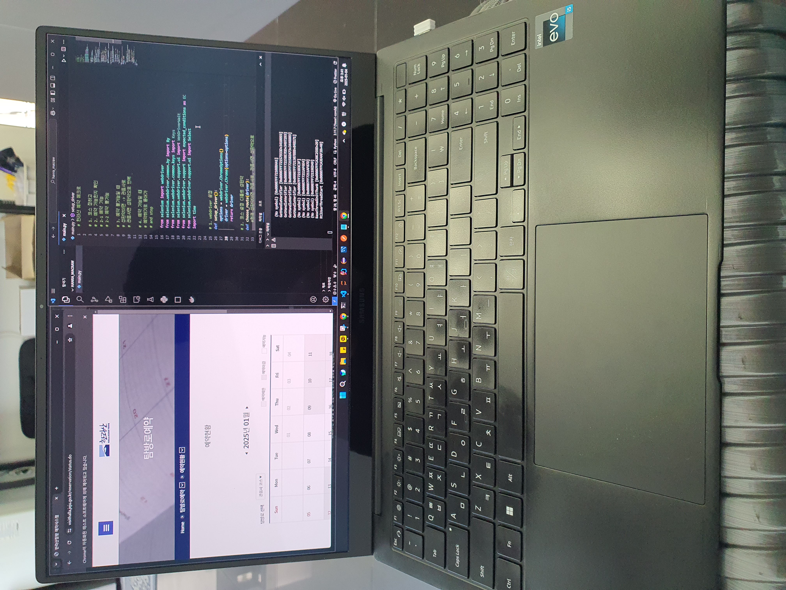

# hallasan_macro

## 개요

한라산 가려고 하는데 예약이 꽉참
취소표 잡으려고 내가 계속 새로고침 하면서 코스 선택하는거 귀찮아서 매크로 만듦
(렌트카 당일 현장 예약 했더니 2시간 기다려야 해서 기다리는 중에)

## 로직

한라산 예약 메크로

1. 코스 정하고
2. 예약 가능한지 확인
   2-1 예약 가능
   - 예약하기로 들어가 and stop
     2-2 예약 불가능

- 성판악이면 -> 관음사로
- 관음사면 성판악으로 반복

## 문제점

- 예약 부분은 수동으로 해야 된다.
- 예약 자리가 나왔을 때 시간 상관없이 예약 자리 나오는거라 원하는 시간이 아닐수도 있다.
